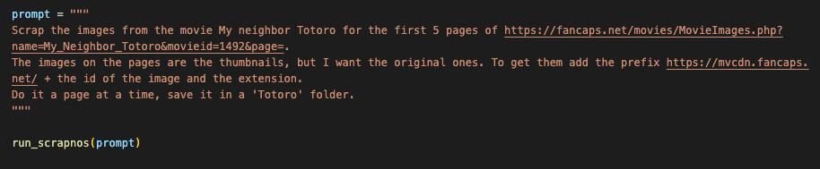

# Agent Scrapnos

A simple Python-based agent to scrape images with function calling [training purpose].



## Installation

1. Clone the repository:
```bash
git clone https://github.com/yourusername/agent-scrapnos.git
cd agent-scrapnos
```

2. Create and activate a virtual environment:
```bash
python -m venv venv
source venv/bin/activate  # On Windows use: venv\Scripts\activate
```

3. Install dependencies:
```bash
pip install -r requirements.txt
```

4. Copy the environment template:
```bash
cp .env-template .env
```

5. Configure your .env file with appropriate credentials
